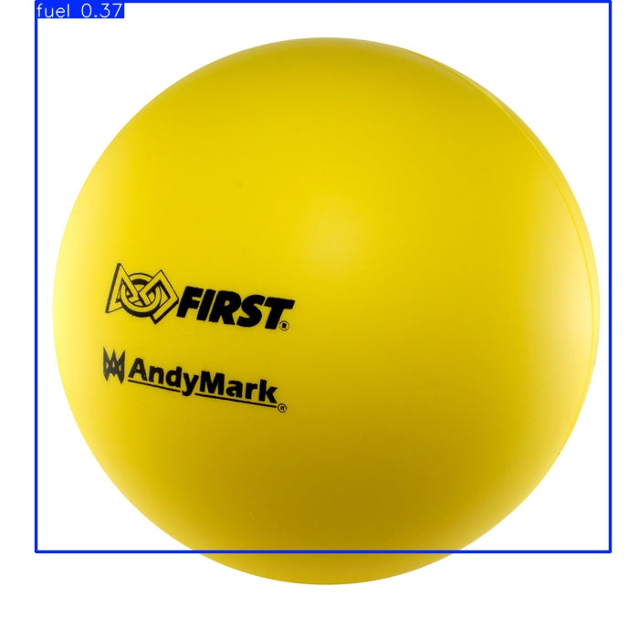
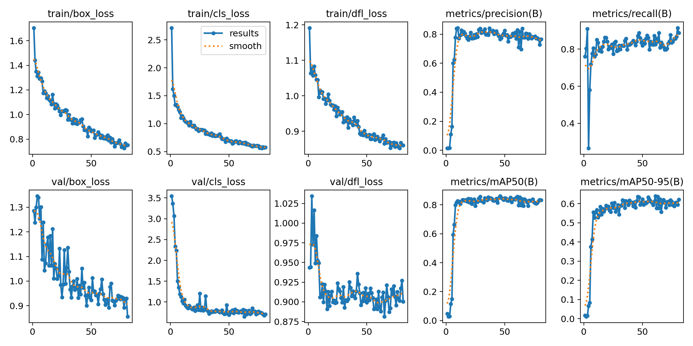
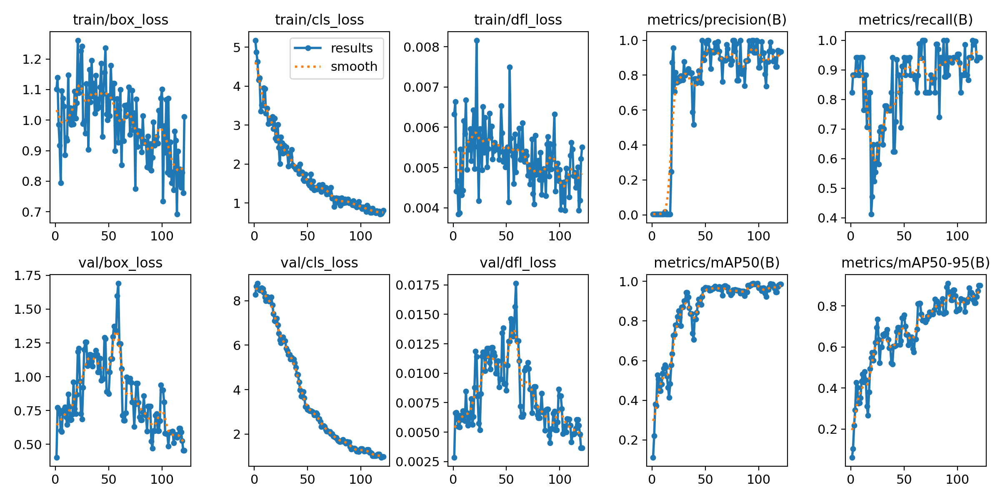

# rebuilt fuel

FRC 2026 Rebuilt fuel detection

## Hugging Face

## Sample Image

## Write-Up

#### Introduction

We present two YOLO object detection models specialized for use in the 2026 FIRST Robotics Competition REBUILT game. These models are able to detect high-density yellow foam balls, called fuel, which are game pieces in REBUILT. Accurate fuel detection could improve robot pathplanning during autonomous. The first model, v0, was trained on a public domain dataset found on the Roboflow platform. This model was based on YOLO11. We found that this dataset contained low-quality images, which led to a poorly performing model. For v1, we decided to make a custom dataset, and use YOLO26 as our base model. The dataset consisted of 54 annotated images capturing the fuel game piece in a variety of positions and locations. Once trained on our custom dataset, the v1 model achieved higher accuracy.

#### Methodology

We used an 80/20 train-validation split. There was no use of offline data augmentation to artificially expand the dataset, due to time constraints. The annotation of the dataset was done on a self-hosted instance of [CVAT (Computer Vision Annotation Tool)](https://github.com/cvat-ai/cvat).

#### Results

**v0**

**v1**

As shown, v1 yields better training results (~97% mAP50) after ~120 epochs. v0 was trained for ~75 epochs and achieved a final mAP50 of ~85%. v1 had a higher label quality/precision, since it was trained on a custom dataset, but limited variety due to the dataset consisting of fewer images than the public dataset. The charts show loss function analysis. 

#### Performance Comparison

| Model | mAP50 | mAP50-95 | Epochs | Dataset |
| :--- | :--- | :--- | :--- | :--- |
| **v0** | ~85% | ~62% | 75 | Large, Public (Roboflow) |
| **v1** | **~97%** | **~88%** | 120 | Small, Custom (CVAT) |

Even with v1 only having 54 images, v1 **significantly outperforms** v0 (+12% mAP50, +26% mAP50-95).

#### Loss function analysis

* box_loss (bounding box regression) on v0 was a smooth, steady decline, while v1 was noisy and fluctuated. This shows that small datasets cause instability. 
* cls_loss (classification loss) on v0 was clean, while v1 had a volatile start, showing models struggle with limited examples.
* dfl_loss (distribution focal loss) on v0 was a stable decrease, while v1 was erratic. This is another issue with data scarcity.

Training v1 for 120 epochs (vs. 75 for v0) helped compensate for the smaller dataset size. The loss oscillations shown suggest the model might be memorizing the training set rather than generalizing, which is common with very small datasets.

#### Conclusion

For this specific task, a smaller, manually curated dataset outperformed a larger but noisy public dataset, highlighting the importance of annotation quality over quantity when data is limited. While the switch from YOLO11 to YOLO26 likely contributed to the performance bump, the dataset quality was a major cause of the improvement in detection.
